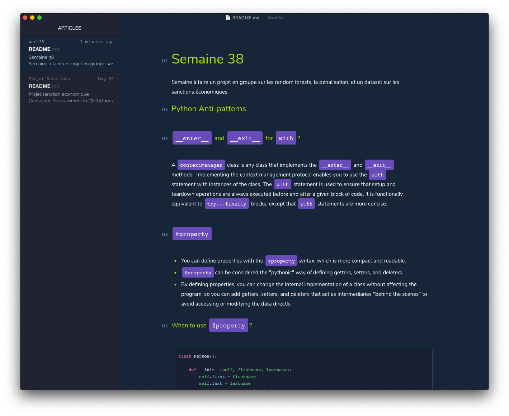

# Hivacruz Theme for Typora

This is a *Work in Progress* to create a [Typora](https://typora.io) theme that matches my [iTerm2 color scheme](https://github.com/kinoute/hivacruz-itermcolors) as well as my [Sublime Text 3 theme](https://github.com/kinoute/hivacruz-sublime-theme). 

**Heavily** inspired by the Cobalt theme. More infos soon.

