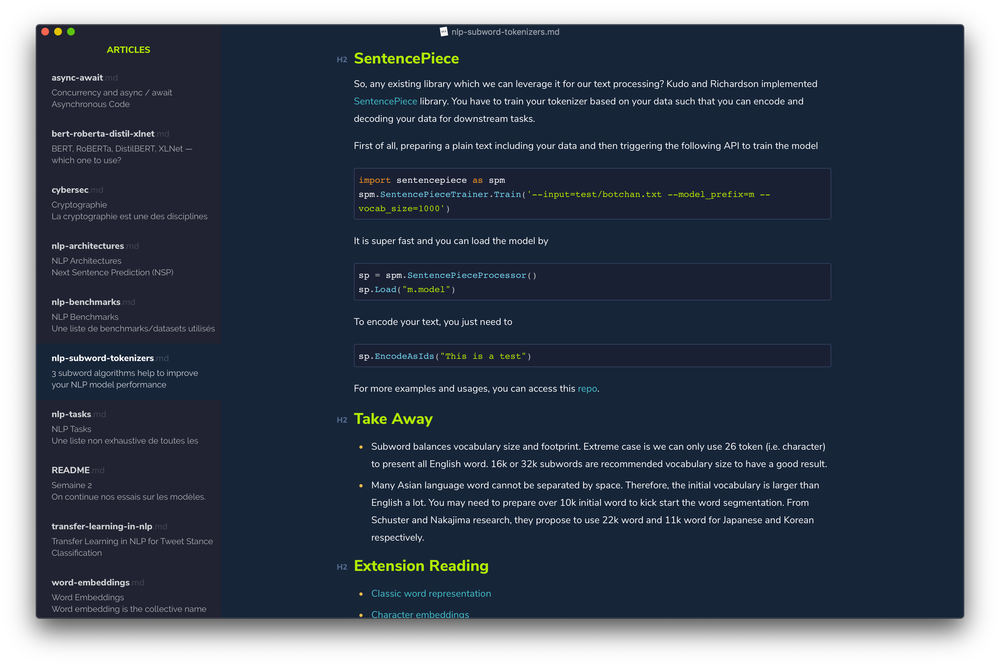
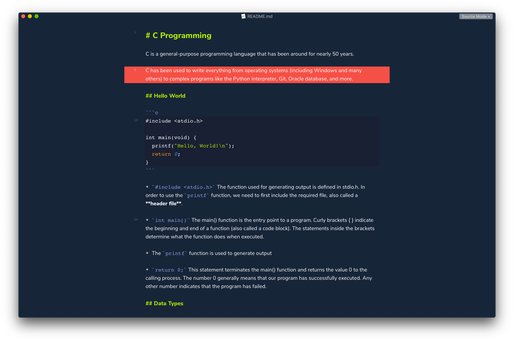
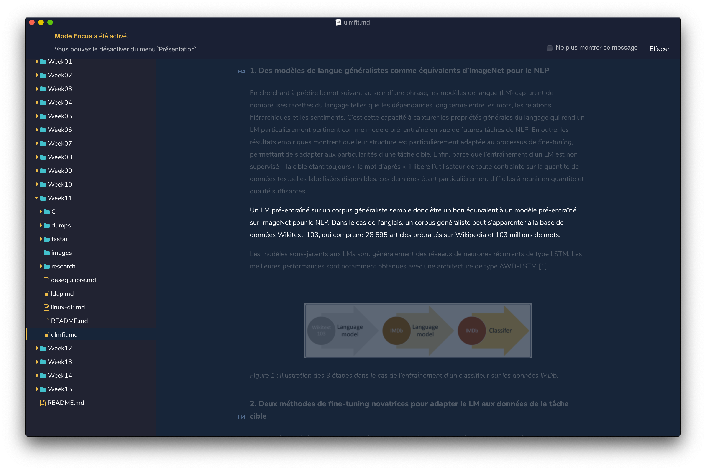
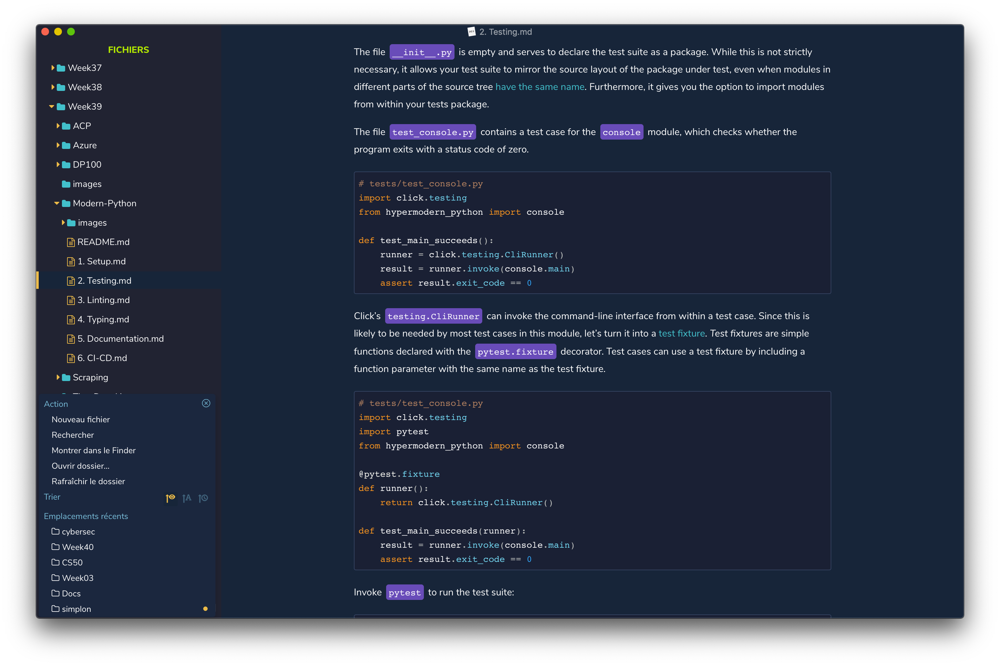
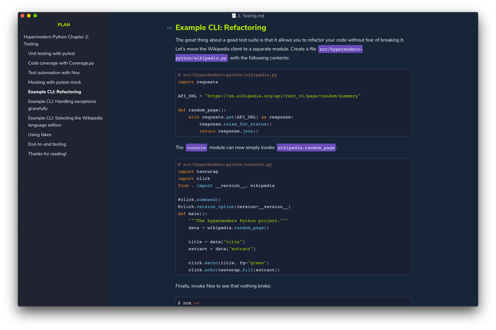

# Hivacruz Theme for Typora

A dark theme for [Typora](https://typora.io), a multi-platform Markdown Editor, that matches my [iTerm2 color scheme](https://github.com/kinoute/hivacruz-itermcolors), my [Sublime Text 3 theme](https://github.com/kinoute/hivacruz-sublime-theme),  as well as my [VSCode theme](https://github.com/kinoute/vscode-hivacruz-theme). Heavily inspired by the [Cobalt](https://github.com/elitistsnob/typora-cobalt-theme) theme.

## Installation

1. Download the zipped project package or the [latest stable release](https://github.com/kinoute/typora-hivacruz-theme/releases).
2. Launch Typora and open `Preferences` from the app menu.
3. Go to the `Appearance` tab, and choose `Open Theme Folder`.
4. Copy the `hivacruz.css` file and `hivacruz` folder to your Typora theme library.
5. Launch or restart Typora and choose `Hivacruz` from the theme menu.

## Status

The theme is usable on all three platforms. Since I have only macOS at my disposal right now to test, the theme might look weird on Windows/Linux and still need improvements.

For that matter, Issues and Pull Requests are very welcome!

## Screenshots

### Articles

###  Source Mode

### Focus Mode

### Code Blocks & Folders Menu

### Plan

## Same theme in other apps

I made similar themes with the same colours for different applications. Here there are:

- Sublime Text theme : https://github.com/kinoute/hivacruz-sublime-theme
- VSCode Theme : https://github.com/kinoute/vscode-hivacruz-theme
- iTerm2 : https://github.com/kinoute/hivacruz-itermcolors

## Credits

* Created by [Yann Defretin](https://github.com/kinoute).
* Forked from the original [Cobalt](https://github.com/elitistsnob/typora-cobalt-theme) theme by [Kent Pribbernow](https://www.github.com/elitistsnob).
* Itself inspired by the [Cobalt](https://github.com/wesbos/cobalt2) Sublime Text Theme by [Wes Bos](https://github.com/wesbos).
* The Font used is [Nunito](https://fonts.google.com/specimen/Nunito) designed by Vernon Adams.
